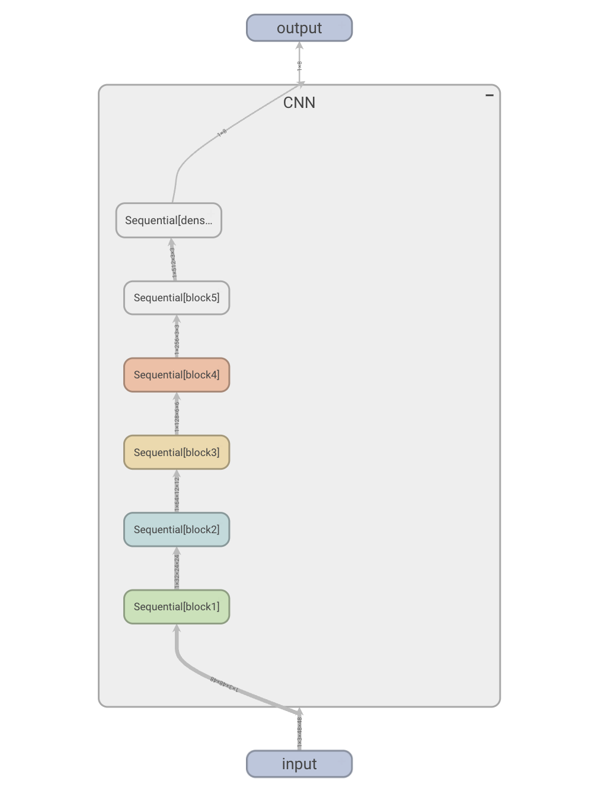
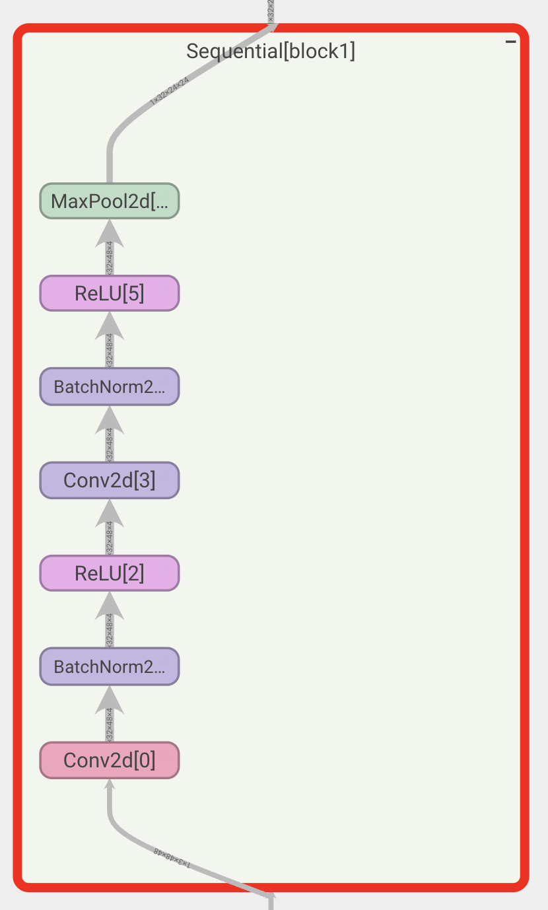
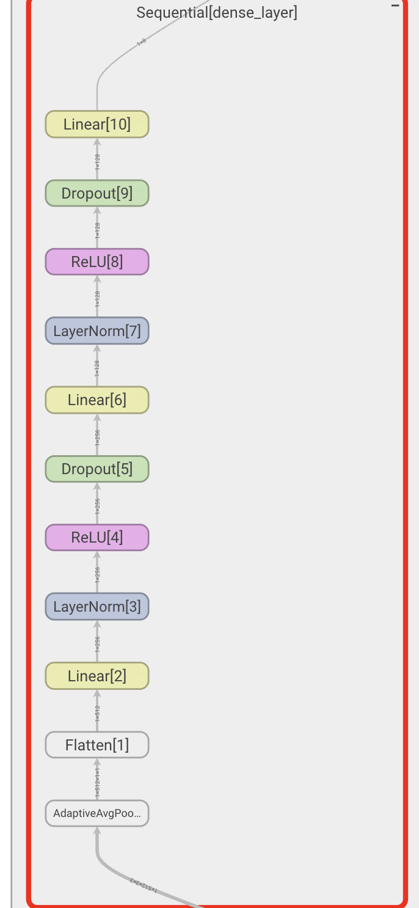
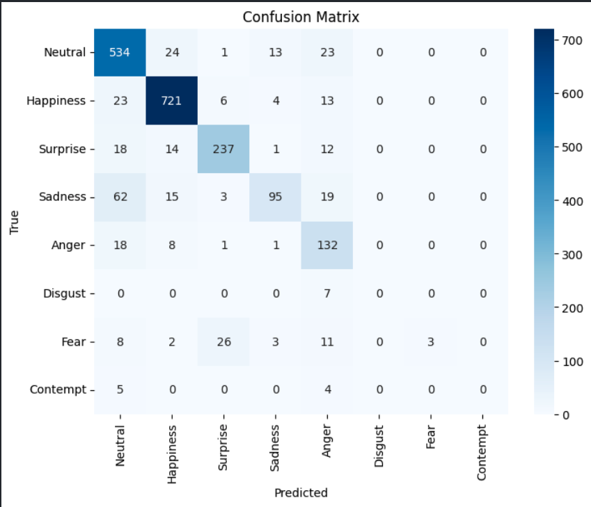

# Deep Learning Project

## Authors:

* Mykhailo Kruts
* Yevhen Zinenko
* Oleksandr Shmelov

## Description
This project focuses on building a Convolutional Neural Network (CNN) to classify emotions from facial images.   It demonstrates the application of deep learning techniques in image processing, model design, and performance evaluation.

Key Features:
1. Custom CNN Model: A tailored architecture designed for emotion classification.
2. Data Preprocessing and Augmentation: Techniques to enhance image data quality and improve model robustness.
3. Hyperparameter Tuning: Optimized training using carefully adjusted parameters.
4. Comprehensive Evaluation: Model performance assessed with appropriate metrics and analysis.

Dataset: `FER_2013+`

The FER+ annotations provide a set of new labels for the standard Emotion FER dataset. In FER+, each image has been labeled by 10 crowd-sourced taggers, which provide better quality ground truth for still image emotion than the original FER labels. Having 10 taggers for each image enables researchers to estimate an emotion probability distribution per face. This allows constructing algorithms that produce statistical distributions or multi-label outputs instead of the conventional single-label output,


## Pre-requisites

* Python v3.10
* Git LFS

## Set-up

Set-up the environment

```
python3.10 -m venv .venv
source .venv/bin/activate
pip install -r requirements.txt
```

### 🚨 Important Notice
Please pay attention to this crucial information!  

Git utilizes a separate library `LFS` to handle loading and tracking large file > 100MB.  
File `fer2013.csv` which contains original images of FER dataset has a size ~200MB.

Command to check if Git LFS exists:
```
git lfs --version
```

If LFS is not present run these:
```
git lfs install 
git lfs pull
```

## Generate Dataset

Before proceeding check again if Git **LFS** is present.
Assuming you are in the current directory of this project, run this command:

```
python fer_generator/generate_training_data.py -d ./data -fer fer_generator/fer2013.csv -ferplus fer_generator/fer2013new.csv
```

## Run Tensorboard

In order to see the graphs of training logs run this command:
```
tensorboard --log_dir=./runs
```

## Methodology


File containing main CNN implementation: [CNN_Default.ipynb](./CNN_Default.ipynb)

#### Augmentations

When the Dataset is loaded every image has a 50% chance of being augmented. Therefore, each run contains a different set of transformed and original images.

Only Training dataset has augmentations applied.

Augmentations applied: 

- RandomHorizontalFlip: Flips the image horizontally with a 50% chance.
- RandomRotation: Rotates the image within ±10 degrees.
- ColorJitter: Slightly adjusts brightness and contrast by ±5%.
- RandomResizedCrop: Crops a random portion (90-100%) and resizes to 40×40.
- RandomAffine: Applies rotation (±10 degrees) and translation (10% shift).

After all augmentations we `resize back` to original sizing of `48x48` and `Normalize` the images.

#### Model architecture

The architecture consists of 5 sequential convolution blocks and 1 dense layer.



Sequential block architecture: 



Dense layer architecture:



#### Optimization

Regularization techniques used:

* Dropout layer
* Early stopping    (latest used patience: 8)
* L2 regularization (latest used decay: 1e-7)

Hyperparameters adjusted:

* Learning rate
* Dropout rate
* Patience for early stopping 
* Batch Size        (latest used batch size: 64)

## Findings 

Latest run evaluation of model using latest architecture and hyperparameters: 

```
Test Accuracy: 0.8331
Test Precision 0.8375
Test Recall: 0.8331
Test F1 score: 0.8184
```

Confusion matrix of predicted and actual emotions: 



What results can we derive from this matrix?

**Overall Strengths**
* The model performs well for dominant classes like Neutral, Happiness, and Surprise, showing its ability to extract and classify features for these emotions.
* It has fewer misclassifications for the dominant classes, suggesting good generalization for these categories.

**Class Imbalance:**
* Classes like Neutral and Happiness dominate in both true positives and total predictions.
* Rare classes like Disgust and Contempt are underrepresented, leading to poor model performance on these categories.


**Confusion Patterns** 
* Neutral and Sadness: These two classes are often confused, which makes sense as their visual features can overlap in certain contexts.
* Surprise and Fear: There is notable confusion between these classes, likely due to similarities in facial expressions (e.g., wide-open eyes).
* Sadness and Anger: These classes show some confusion, indicating the need for better feature extraction to differentiate them.


## Implemented extensions

1. Cropped and alligned images
2. Face detectors
3. Real time application

**Prerequisities**:

Run all cells in [CNNFaceDetector.ipynb](./CNNFaceDetector.ipynb) in order to generate `model_face_detector` model.

Next, you can run live tracking of your emotions!

Allow program to utilize your webcam.

Run tracking:

```
python video_application.py
```

## Future recommendations

1. Balanced Dataset:
Collect more samples for rare classes or use oversampling techniques to balance the training set.

2. Weighted Loss:
Use a weighted loss function to penalize misclassifications of rare classes more heavily.